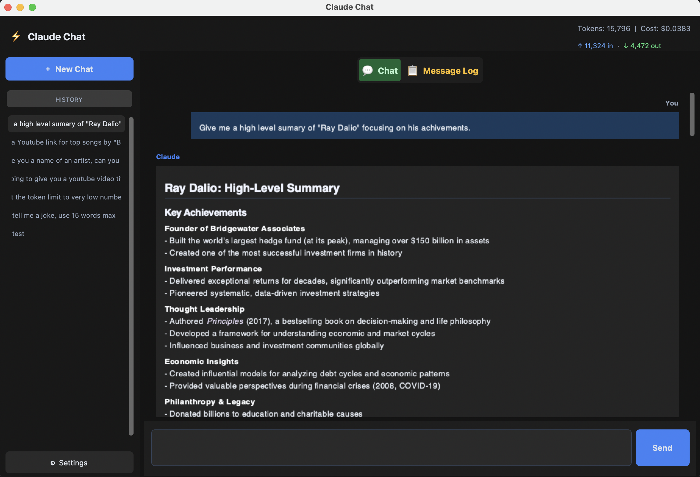

# A simple desktop app for chatting with Claude, built by Claude

## What is it?
It is a simple desktop app for chatting with Claude that gives users more control than the standard web interface.
Your conversation history lives on your computer, you can choose the models you want to talk to, and keeps track of the cost.




## Why?
To test out Claude's functionality(Sonnet 4.6 Extended). ***The app was 100% built by Claude, with guidance from a human.***

## Chat configuration
- Select between models (Opus, Sonnet, Haiku)
- Set the [Temperature](https://platform.claude.com/docs/en/about-claude/glossary#temperature) parameter (controls the randomness in the response)
- Set a System Prompt for conversations
- Set a token limit per response

## Key Features
- Your API key is stored securely in your operating system's password manager
- Full markdown rendering — code, tables, and formatting display correctly
- A detailed message log showing timestamps, token counts, errors and cost per chat
- Works offline for reading past conversations


## Instructions

1. Set up a Python virtual environment using [requirements.txt](./claude_chat_app/requirements.txt)
2. Get the [API Key](https://platform.claude.com/settings/keys) (purchase required)
3. Run `python ./claude_chat_app/main.py`
4. Click on ⚙Settings, paste in the API key and click Save Setting
5. Chat away!

## Local Data Storage

The app stores all data in a hidden folder in your home directory:
```
~/.claude_chat_app/
├── config.json
├── usage.json
└── history/
    ├── 3fa2b1c0-xxxx-xxxx-xxxx-xxxxxxxxxxxx.json
    ├── 7d4e9f2a-xxxx-xxxx-xxxx-xxxxxxxxxxxx.json
    └── ...
```

### Files

**`config.json`**
Your settings — model choice, max tokens, temperature, and system prompt.
The API key is intentionally absent from this file; it is stored securely in your operating system's keychain instead.

**`usage.json`**
A running total of every token and dollar spent across all sessions, broken down by model.

**`history/`**
One JSON file per conversation, named by a unique ID.
Each file contains the full message list for that chat including timestamps, token counts, stop reasons, and any errors that occurred.
